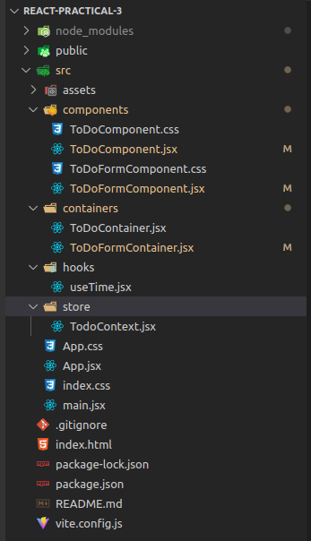
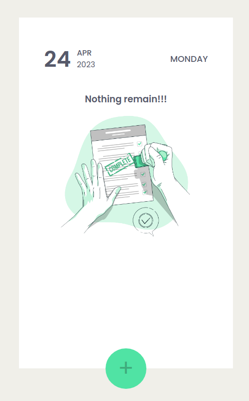

# React-Practical-3

This is a simple To-Do List project built using React. It allows users to add and delete as well as mark them as completed.

## Deployement Link

```jsx
https://react-practical-3.netlify.app/
```

## **Getting Started**

To get started with the project, follow the instructions below.

### **Prerequisites**

To run the project, you need to have Node.js and npm installed on your system. If you don't have them installed, you can download and install them from the **[Node.js website](https://nodejs.org/en/download/)**.

### **Installation**

1. Clone the repository to your local machine.
    
    ```
    git clone https://github.com/zilenmodi/React-Practical-3.git
    ```
    
2. Navigate to the project directory.
    
    ```
    cd React-Practical-3
    ```
    
3. Install the required dependencies.
    
    ```
    npm install
    ```
    
4. Start the development server.
    
    ```
    npm run dev
    ```
    

## Folder Structure

- **Store Folder**
    
    The store folder contains the **`TodoContext.js`** file, which defines the context and reducer for the To-Do List application. The **`TodoContext`** provides a global state and actions for manipulating the state. The **`reducer`** function defines how the state should be updated based on the actions that are dispatched.
    
- **Hooks Folder**
    
    The hooks folder contains the **`useTime.js`** file, which defines a custom hook that returns the current time as a string. This hook is used in the components to display today’s date.
    
- ********************************Containers Folder********************************
    
    Container components are responsible for managing the state of the application and passing down data and functions to child components.
    
- **Components Folder**
    
    Presentational components, also known as dumb or stateless components, are responsible for rendering the UI of the application.
    
    
    

## **Usage**

- Once you have started the development server, you can access the app by visiting [http://localhost:5173](http://localhost:3000/) in your web browser.
- You can add a task by typing it in the input field and pressing the Enter key. To mark a task as completed, click on the checkbox next to it. To delete a task, write “DELETE” in input field and hit Enter key.

## **Features**

The To-Do List app comes with the following features:

- Add new tasks to the list.
- Mark tasks as completed.
- Delete all tasks from the list.

## Snapshot



## **Built With**

The To-Do List app was built using the following technologies:

- React
- HTML
- CSS

## **License**

This project is licensed under the MIT License. See the **[LICENSE](https://chat.openai.com/LICENSE)** file for details.